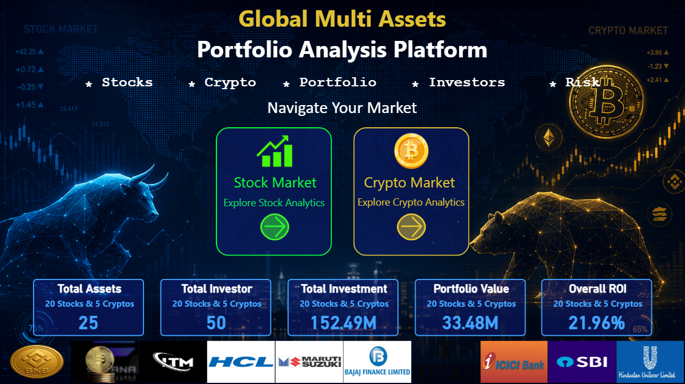
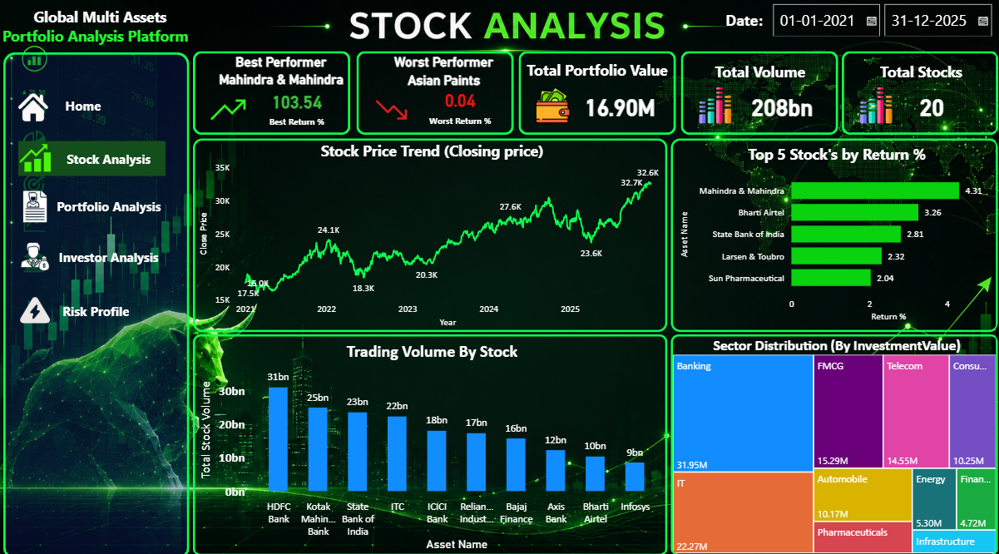
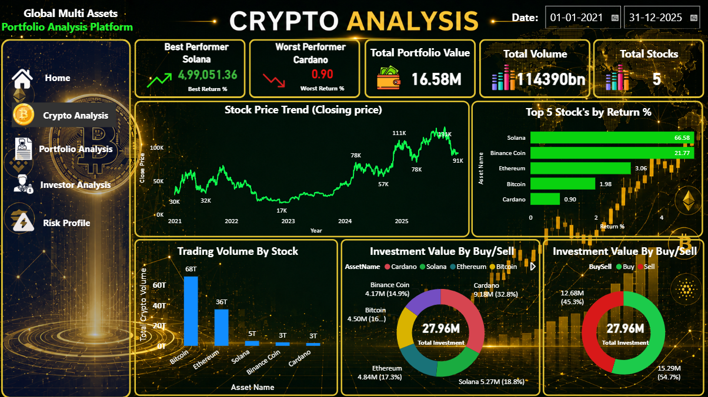
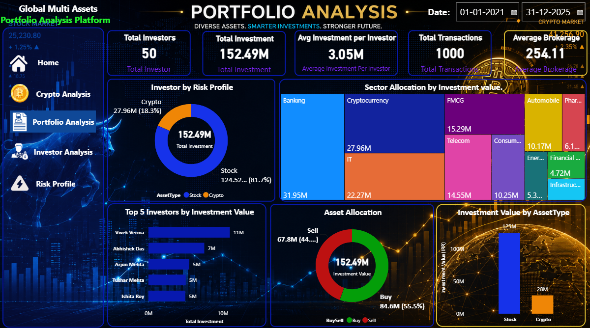
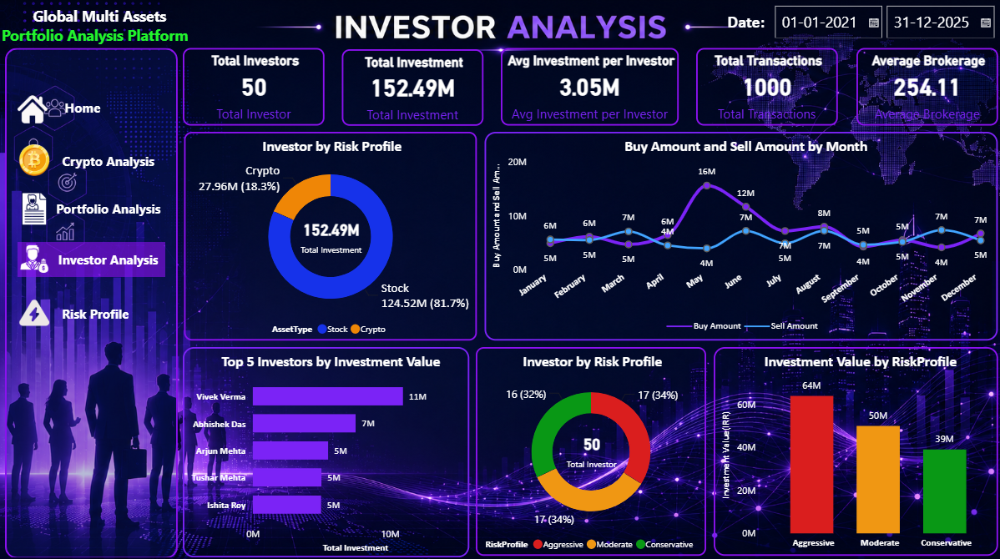
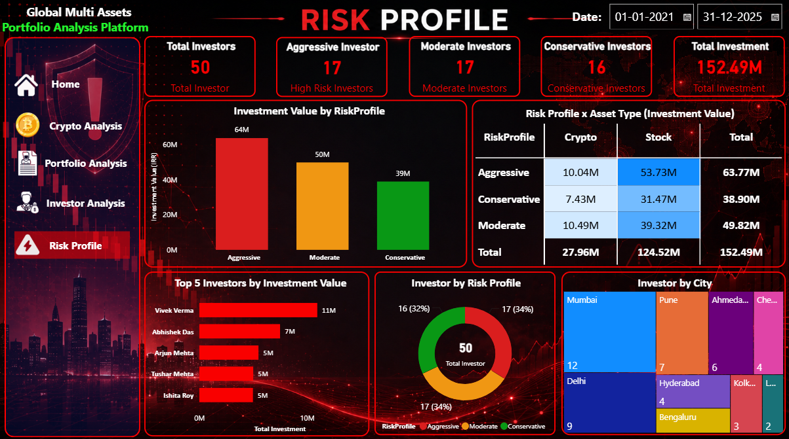

<h1 align='center'> Global Multi Assets Portfolio Analysis Platform</h1>

<p align="center">
  
  
  
  
</p>

A modern **Power BI Business Intelligence Dashboard** designed to analyze investment portfolios across **Stocks and Cryptocurrencies**. This project provides a complete view of portfolio performance, investor behavior, market trends, asset allocation, and risk distribution using an interactive multi-page dashboard.

---

## Project Overview

Managing investments across multiple asset classes requires continuous monitoring of portfolio performance, market trends, investor activity, and risk exposure.

This dashboard transforms raw financial transaction data into actionable business insights by combining advanced Power BI visualizations, DAX measures, and interactive filtering.

The solution is divided into six analytical modules covering every major aspect of portfolio management.

---

# Dashboard Pages

### 1. Home

Provides a high-level overview of the complete investment portfolio.

**Features**

- Total Assets
- Total Investors
- Total Investment
- Portfolio Value
- Overall ROI
- Interactive Navigation
- Company & Cryptocurrency Overview

---

### 2. Stock Analysis

Comprehensive analysis of stock investments.

**Includes**

- Best Performing Stock
- Worst Performing Stock
- Total Portfolio Value
- Total Trading Volume
- Total Listed Stocks
- Stock Price Trend
- Top Performing Stocks
- Trading Volume Analysis
- Sector Distribution

---

### 3. Crypto Analysis

Dedicated dashboard for cryptocurrency investments.

**Includes**

- Best Performing Cryptocurrency
- Worst Performing Cryptocurrency
- Crypto Portfolio Value
- Trading Volume
- Price Trend
- Top Performing Cryptocurrencies
- Portfolio Allocation
- Buy vs Sell Analysis

---

### 4. Portfolio Analysis

Provides complete portfolio performance across all asset classes.

**Includes**

- Total Investors
- Total Investment
- Average Investment per Investor
- Total Transactions
- Average Brokerage
- Asset Allocation
- Sector Allocation
- Top Investors
- Buy vs Sell Investment
- Investment by Asset Type

---

### 5. Investor Analysis

Analyzes investor behavior and investment patterns.

**Includes**

- Total Investors
- Total Investment
- Average Investment
- Total Transactions
- Average Brokerage
- Investment Trend
- Risk Profile Distribution
- Top Investors
- Investment by Risk Profile

---

### 6. Risk Profile

Analyzes portfolio exposure based on investor risk appetite.

**Includes**

- Aggressive Investors
- Moderate Investors
- Conservative Investors
- Total Investment
- Investment by Risk Profile
- Risk Profile vs Asset Type Matrix
- Top Investors
- Investor Distribution
- City-wise Investor Distribution

---

# Repository Structure

```
global-multi-assets-portfolio-analysis-platform/

│
├── 01_raw_data/
│   └── Global_Multi_Assets_Dataset.xlsx
│
├── 02_powerbi_report/
│   └── Global Multi Assets Portfolio Analysis Platform.pbix
│
├── 03_documentation/
│   ├── Business_Requirements_&_Data_Dictionary.pdf
│   └── Dashboard_Screenshots/
│
├── assets/
│   ├── Home.png
│   ├── Stock_Analysis.png
│   ├── Crypto_Analysis.png
│   ├── Portfolio_Analysis.png
│   ├── Investor_Analysis.png
│   └── Risk_Profile.png
│
├── README.md
└── LICENSE
```

---

# Dashboard Features

- Interactive Navigation
- Multi-page Dashboard
- Dynamic KPI Cards
- Cross Filtering
- Slicers
- Drill Down
- Professional UI
- Custom Background Design
- Responsive Layout
- Business-Oriented Visualizations

---

# Key KPIs

- Portfolio Value
- Total Investment
- Overall ROI
- Total Investors
- Total Transactions
- Average Brokerage
- Best Performer
- Worst Performer
- Trading Volume
- Asset Allocation
- Sector Distribution
- Buy vs Sell Investment
- Risk Distribution

---

# Data Model

The project follows a **Star Schema**.

### Fact Tables

- Fact_Stocks
- Fact_Crypto
- Fact_Transactions

### Dimension Tables

- Dim_Date
- Dim_Assets
- Dim_Investors

---

# Technologies Used

- Microsoft Power BI
- Power Query
- DAX
- Data Modeling
- Excel
- Star Schema
- Interactive Dashboard Design

---

# Power BI Skills Demonstrated

- Data Cleaning
- Data Transformation
- Data Modeling
- Relationship Management
- DAX Measures
- Calculated Columns
- KPI Design
- Advanced Visualizations
- Dynamic Filtering
- Dashboard Navigation
- Business Storytelling

---

# Business Questions Answered

### Stock Analysis

- Which stock generated the highest return?
- Which stock underperformed?
- Which sectors attract the highest investment?
- What is the stock trading volume?

### Crypto Analysis

- Which cryptocurrency performs best?
- How is investment distributed across cryptocurrencies?
- What is the crypto trading volume?
- What is the buy vs sell distribution?

### Portfolio Analysis

- How is the investment allocated?
- Which sectors dominate the portfolio?
- Who are the top investors?
- What is the stock vs crypto allocation?

### Investor Analysis

- Who invests the most?
- What are monthly investment trends?
- What is the average investment?
- How are investors distributed across risk profiles?

### Risk Analysis

- Which risk profile dominates?
- How much investment belongs to each risk category?
- What is the asset distribution by risk profile?
- Which cities have the highest investor concentration?

---

# Dashboard Highlights

✅ Interactive Navigation

✅ Dynamic KPIs

✅ Professional UI

✅ Financial Dashboard Design

✅ Multi Asset Portfolio Analysis

✅ Investment Analytics

✅ Risk Profiling

✅ Portfolio Monitoring

---

# Dashboard Preview

| Home | Stock Analysis |
|------|----------------|
|  |  |

| Crypto Analysis | Portfolio Analysis |
|-----------------|--------------------|
|  |  |

| Investor Analysis | Risk Profile |
|-------------------|--------------|
|  |  |

---

# How to Use

1. Clone the repository

```
git clone https://github.com/vipulsystems/global-multi-assets-portfolio-analysis-platform.git
```

2. Open the Power BI report

```
02_powerbi_report/
```

3. Open

```
Global Multi Assets Portfolio Analysis Platform.pbix
```

4. Refresh the data if required.

---

# Future Improvements

- Live Stock Market API Integration
- Live Cryptocurrency Price Integration
- Portfolio Optimization
- Sharpe Ratio
- Beta Analysis
- Value at Risk (VaR)
- Monte Carlo Simulation
- Power BI Service Deployment
- Mobile Dashboard

---

# Author

**Vipul Paighan**

Email: **vipul.paighan.in@gmail.com**

GitHub: https://github.com/vipulsystems

---

# Support

If you found this project useful, consider giving it a ⭐ on GitHub.

---

## License

This project is licensed under the MIT License.